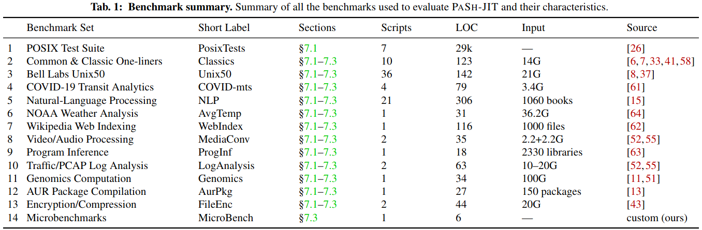

# Getting Started Instructions

The structure of this document mirrors [the OSDI22 artifact "evaluation process"](https://www.usenix.org/conference/osdi21/call-for-artifacts). At a glance:

* [x] [Artifact available](#artifact-available): Pointers to GitHub, Dockerhub, and the Linux Foundation
* [x] [Artifact functional](#artifact-functional): Documentation, completeness wrt to claims in paper, and exercisability
* [x] [Results reproducible](#results-reproducible): Correctness (§7.1) performance (§7.2), microbenchmarks (§7.3)

To "kick the tires" for this artifact:

* skim this README file to get an idea of the structure (2 minutes) and possible setup options (e.g., accounts on `deathstar` and `antikythera`; and Docker VM);
* jump straight into the "[Exercisability"](#exercisability) section of the README file (13 minutes).

# Artifact available

The implementation described in the OSDI paper (PaSh-JIT) has been incorporated into PaSh, MIT-licensed open-source software supported by the Linux Foundation. Below are some relevant links:

* PaSh is permanantely hosted on the GitHub [binpash](https://github.com/binpash/) organization.
* The PaSh website is available at [binpa.sh](https://binpa.sh) and [https://binpash.github.io/web/](https://binpash.github.io/web/).
* PaSh has joined [the Linux Foundation](https://www.linuxfoundation.org/press-release/linux-foundation-to-host-the-pash-project-accelerating-shell-scripting-with-automated-parallelization-for-industrial-use-cases/) and is available via [Dockerhub](https://hub.docker.com/r/binpash/pash)
* PaSh developers hang out on the [pash-discuss](https://groups.google.com/g/pash-discuss) mailing list and [discord](https://discord.com/channels/947328962739187753).

PaSh is developed actively, forms the foundation of further research on the shell, and has received open-source contributions from developers outside the core development team.

# Artifact functional

## Documentation

* [Repo README](https://github.com/binpash/pash)
  * [Annotations](https://github.com/binpash/pash/tree/main/annotations): DSL characterizing commands, parallelizability study, and associated annotations
    * [C Stats](https://github.com/binpash/pash/tree/main/annotations/c_stats): command statistics
    * [P Stats](https://github.com/binpash/pash/tree/main/annotations/p_stats): parallelizability statistics
  * [Compiler](https://github.com/binpash/pash/blob/main/compiler): Shell-dataflow translations and associated parallelization transformations
    * [Parser Library](https://github.com/binpash/pash/tree/main/compiler/parser)
    * [Parser Library Internals](https://github.com/binpash/pash/tree/main/compiler/parser/ceda)
  * [Docs](https://github.com/binpash/pash/tree/main/docs): Design documents, tutorials, installation instructions, etc.
    * [Contributing Guide](https://github.com/binpash/pash/blob/main/docs/contributing/contrib.md)
    * [Installation Instructions](https://github.com/binpash/pash/tree/main/docs/install)
      * [Installing on Windows](https://github.com/binpash/pash/blob/main/docs/contributing/contrib.md#installing-wsl-on-windows)
    * [Short Tutorial](https://github.com/binpash/pash/blob/main/docs/tutorial/tutorial.md)
  * [Benchmarks](https://github.com/binpash/pash/tree/main/evaluation/benchmarks)
  * [Runtime](https://github.com/binpash/pash/blob/main/runtime): Runtime component — e.g., eager, split, and associated combiners.
    * [Aggregators](https://github.com/binpash/pash/tree/main/runtime/agg)
  * [Scripts](https://github.com/binpash/pash/blob/main/scripts): Scripts related to continuous integration, deployment, and testing.
    * [Docker Support](https://github.com/binpash/pash/tree/main/scripts/docker)
  

## Completeness 

At a high level, the paper claims three contributions (page 2)

1. A dynamic interposition framework for the shell (§3, 4)
2. A stateful, parallelizing compilation server (§5)
3. Commutativity-aware optimization (§6)

Fig. 1 of the paper gives an overview of the interaction between different components and the correspondence of system components to sections. Below we provide links to the source code implementing them.

* *Preprocessor (§3.1 and §3.2):* The [preprocessor](https://github.com/binpash/pash/blob/main/compiler/pash.py) uses the parser (below) to instrument the AST with calls to the [JIT Engine](https://github.com/binpash/pash/blob/main/compiler/pash_runtime.sh). Note here that the terminology in the paper is somewhat different from the code; we hope to align the two soon.

* *Parsing library (§3.3):* The [parsing library](https://github.com/binpash/pash/blob/main/compiler/parser/ceda/) contains Python bindings for the dash [parser](https://github.com/binpash/pash/tree/main/compiler/parser) translates dash's AST to a Python AST) and a complete [unparser implementation](https://github.com/binpash/pash/blob/main/compiler/parser/ceda/ast2shell.py).

* *JIT engine (§4):* The [JIT engine](https://github.com/binpash/pash/blob/main/compiler/pash_runtime.sh) transitions between shell and PaSh mode and interacts with the the stateful compilation server. The engine sends compilation requests to the parallelizing compilation server (below) and waits for a response: If the server succeeds at compiling and parallelizing the requested region, then the engine runs the parallel shell script; if the server fails, then it's not safe to parallelize this region and the engine runs the original code.

* *Parallelizing compilation server (§5):* The [parallelizing compilation server](https://github.com/binpash/pash/blob/main/compiler/pash_runtime_daemon.py) handles compilation requests for parallelizing regions of the script. The server contains the following subcomponents: (i)The [expansion component](https://github.com/binpash/pash/blob/main/compiler/expand.py), which expands script fragments; (ii) the dependency untangling component (§5.2) invoked with `--parallel_pipelines` and extracting additional parallelization consists of a [check for detecting dependencies between fragments](https://github.com/binpash/pash/blob/main/compiler/pash_runtime_daemon.py#L155) after [compilation succeeds](https://github.com/binpash/pash/blob/main/compiler/pash_runtime_daemon.py#L317) [executing the optimized script in parallel](https://github.com/binpash/pash/blob/main/compiler/pash_runtime.sh#L257); and (iii) the [profile-driven optimization component](https://github.com/binpash/pash/blob/main/compiler/pash_runtime_daemon.py#L172) (§5.3), invoked with `--profile-driven`, adjusting the parallelization factor based on previous execution times.
 
* *Commutativity awareness (§6):* It consists of the following components: (i) annotations indicating whether a command is commutative (e.g., [sort](https://github.com/binpash/pash/blob/main/annotations/sort.json#L18)) and (ii) dataflow nodes for orchestrating commutativity-aware concurrency — e.g., [c-split](https://github.com/binpash/pash/blob/main/runtime/r_split.c), [c-wrap](https://github.com/binpash/pash/blob/main/runtime/r_wrap.c), [c-strip](https://github.com/binpash/pash/blob/main/runtime/r_unwrap.c), and [c-merge](https://github.com/binpash/pash/blob/main/runtime/r_merge.c).

* The paper additionally claims that core of the server has been *modelled and formally verified using SPIN*. The modeling of the dependency untangling algorithm in Promela (SPIN's language) can be found in [algorithm.pml](https://github.com/binpash/pash/tree/osdi22-ae/evaluation/osdi22-eval/algorithm.pml). The model captures compilation requests of regions with non-deterministic read/write dependencies, and ensures that no two regions with dependencies are running together, while also ensuring that both the server and the engine eventually terminate.


## Exercisability

**Requirements**
For the "results reproducible" badge, the artifact has a few different hardware/software requirements. 
- Performance has the following requirements, which are met by a server that we give you access to, or can be met using the `binpash/pash:latest` docker image (but you would have to run it on your own infrastructure):
  * Hardware: a modern multi-processor, to show performance results (the more cpus, the merrier)
  * Software: automake bc curl gcc git libtool m4 python sudo wget bsdmainutils libffi-dev locales locales-all netcat-openbsd pkg-config python3 python3-pip python3-setuptools python3-testresources wamerican-insane

The modelling and formal verification of the dependency untangling algorithm requires [Spin](https://spinroot.com).


**Remote servers used to evaluate PaSh:**
We have created a `osdi22` account on the machines used to evaluate PaSh:

* `antikythera.csail.mit.edu`: a server hosting the POSIX test suite for correctness/compability results (§7.1); the POSIX test suite cannot be shared publicly.

* `deathstar.ndr.md`: a large multiprocessor used for performance results (§7.2, 7.3). 

> _Reviewers should coordinate to not run checks/experiments at the same time_. 

To connect to these machines, use:

```sh
ssh osdi22@deathstar.ndr.md -i ~/.ssh/pash.key
# run a simple command with pash. This should run without any issue
$PASH_TOP/pa.sh -c 'echo Hello World!'
```

```sh
ssh  osdi22@antikythera.csail.mit.edu -i ~/.ssh/pash.key
# create a new instance of the container
docker run -it --sig-proxy=false posix /bin/bash
# run a simple command
$PASH_TOP/pa.sh -c 'echo Hello World!'
```

**Local installation (Docker):**
PaSh is an open-source project and can be installed on a variety of platforms. For example, another way to try PaSh is locally through a Docker container, running a pre-setup ubuntu Linux.
Information about docker installation may be found in [here](https://github.com/binpash/pash/tree/main/docs/install#docker-setup).

> We do not recommend local installation for evaluating the "results reproducible" badge due to docker overheads and hardware differences.

If you want to simply run the latest stable version of PaSh, you can use the following:

```sh
docker pull binpash/pash; docker run --name pash-playground -it binpash/pash
$PASH_TOP/pa.sh -c 'echo Hello World!'         # this is typed _in_ the container
```

In order to later generate the performance figures, [install the R environment](https://cran.r-project.org/bin/linux/ubuntu/) and then install ggplot2 for R:
```sh
sudo R
> install.packages('ggplot2', dep = TRUE)
> q()
> n
```

If you are interested in using the version of PaSh when it was submitted to OSDI 2022, you could install PaSh on a fresh docker container using the following instructions:

```sh:
docker run -it ubuntu:18.04 /bin/bash

##
## In docker
##

apt update
apt install sudo git libjpeg-dev zlib1g-dev unzip
sudo apt remove nodejs

git clone https://github.com/binpash/pash.git
cd pash
git checkout osdi22-ae
./scripts/distro-deps.sh
./scripts/setup-pash.sh
export PASH_TOP=/pash
$PASH_TOP/pa.sh -c 'echo Hello World!'
```

## A Minimal Run: Demo Spell

> These instructions should work on any of the environments above (`antikythera`, `deathstar`, or locally in Docker)

All scripts in this guide assume that `$PASH_TOP` is set to the top directory of the PaSh codebase (i.e., `~/pash` on `deathstar` or `/opt/pash` in docker). This variable should be correctly configured already.

We will use `demo-spell.sh` --- a pipeline based [on the original Unix spell program](https://dl.acm.org/doi/10.1145/3532.315102) by Johnson --- to confirm that the infrastructure works as expected.

First, let's take a quick look at `spell`:

```sh
cd $PASH_TOP/evaluation/intro
cat demo-spell.sh
```

The script streams the input file into a pipeline that converts characters to lower case, removes punctuation, sorts in alphabetical order,  removes duplicate words, and filters out words from a dictionary file.

Next, let's run it on sequential inputs:

```sh
# download the input data
cd input && bash setup.sh && cd ../
time ./demo-spell.sh > spell.out
```

We prefix the script with the `time` command, which should also output how long it took for the script to execute.
On `deathstar`, it takes about 41s.

To execute it using `pash` with 2x-parallelism:

```sh
time $PASH_TOP/pa.sh -w 2 demo-spell.sh > pash-spell.out
``` 

On `deathstar`, the 2x-parallel script takes about 28s.


You can check that the results are correct by:

```sh
cmp spell.out pash-spell.out && echo "Files are identical"
```

You could also execute it with 8x-parallelism using:
```sh
time $PASH_TOP/pa.sh -w 8 --graphviz pdf --graphviz_dir . demo-spell.sh > pash-spell.out
``` 
which takes about 14s.

The `--graphviz` option generates a graph in a directory `./pash_graphviz_<TIMESTAMP>`.

A sample graph may be viewed [here](./pdfs/dfg.pdf).

To view the actual parallel shell code emitted by the compiler, you can inspect the log by running:

```sh
time $PASH_TOP/pa.sh -w 8 -d 1 --log_file pash.log demo-spell.sh > pash-spell.out
vim pash.log
```

The contents of the parallel script are shown after the line `(4) Will execute script in ...` and for 2x parallelism (`--width 2`) they should look like this:
```sh
rm_pash_fifos() {
...
mkfifo_pash_fifos() {
...
rm_pash_fifos
mkfifo_pash_fifos
pids_to_kill=""
{ cat "input/100M.txt" >"/tmp/pash_khDRXr7/d8f7c89b966244cbb6b0d8dc0bfb9cb1/#fifo2" & }
pids_to_kill="${!} ${pids_to_kill}"
{ tr -cs A-Za-z "\\n" <"/tmp/pash_khDRXr7/d8f7c89b966244cbb6b0d8dc0bfb9cb1/#fifo4" >"/tmp/pash_khDRXr7/d8f7c89b966244cbb6b0d8dc0bfb9cb1/#fifo6" & }
pids_to_kill="${!} ${pids_to_kill}"
{ /home/osdi22/pash/runtime/auto-split.sh "/tmp/pash_khDRXr7/d8f7c89b966244cbb6b0d8dc0bfb9cb1/#fifo2" "/tmp/pash_khDRXr7/cee3744e05a64336a368295a133679e2/#fifo14" "/tmp/pash_khDRXr7/cee3744e05a64336a368295a133679e2/#fifo15" & }
pids_to_kill="${!} ${pids_to_kill}"
{ tr A-Z a-z <"/tmp/pash_khDRXr7/13d2518bd4ce45279a0128d64763b4f2/#fifo32" >"/tmp/pash_khDRXr7/cee3744e05a64336a368295a133679e2/#fifo17" & }
pids_to_kill="${!} ${pids_to_kill}"
{ tr A-Z a-z <"/tmp/pash_khDRXr7/cee3744e05a64336a368295a133679e2/#fifo15" >"/tmp/pash_khDRXr7/cee3744e05a64336a368295a133679e2/#fifo18" & }
pids_to_kill="${!} ${pids_to_kill}"
{ cat "/tmp/pash_khDRXr7/13d2518bd4ce45279a0128d64763b4f2/#fifo33" "/tmp/pash_khDRXr7/13d2518bd4ce45279a0128d64763b4f2/#fifo34" >"/tmp/pash_khDRXr7/d8f7c89b966244cbb6b0d8dc0bfb9cb1/#fifo4" & }
pids_to_kill="${!} ${pids_to_kill}"
{ /home/osdi22/pash/runtime/auto-split.sh "/tmp/pash_khDRXr7/d8f7c89b966244cbb6b0d8dc0bfb9cb1/#fifo6" "/tmp/pash_khDRXr7/cee3744e05a64336a368295a133679e2/#fifo19" "/tmp/pash_khDRXr7/cee3744e05a64336a368295a133679e2/#fifo20" & }
pids_to_kill="${!} ${pids_to_kill}"
{ sort <"/tmp/pash_khDRXr7/13d2518bd4ce45279a0128d64763b4f2/#fifo35" >"/tmp/pash_khDRXr7/cee3744e05a64336a368295a133679e2/#fifo22" & }
pids_to_kill="${!} ${pids_to_kill}"
{ sort <"/tmp/pash_khDRXr7/cee3744e05a64336a368295a133679e2/#fifo20" >"/tmp/pash_khDRXr7/cee3744e05a64336a368295a133679e2/#fifo23" & }
pids_to_kill="${!} ${pids_to_kill}"
{ sort -m "/tmp/pash_khDRXr7/13d2518bd4ce45279a0128d64763b4f2/#fifo36" "/tmp/pash_khDRXr7/13d2518bd4ce45279a0128d64763b4f2/#fifo37" >"/tmp/pash_khDRXr7/d8f7c89b966244cbb6b0d8dc0bfb9cb1/#fifo8" & }
pids_to_kill="${!} ${pids_to_kill}"

...

{ comm -13 input/sorted_words "/tmp/pash_khDRXr7/13d2518bd4ce45279a0128d64763b4f2/#fifo41" & }
pids_to_kill="${!} ${pids_to_kill}"
source /home/osdi22/pash/runtime/wait_for_output_and_sigpipe_rest.sh ${!} 2>>pash.log
rm_pash_fifos
...
```

Note that most stages in the pipeline are repeated twice and proceed in parallel (i.e., using `&`). This completes the "quick-check".


# Results reproducible

> Make sure you have completed  "Exercisability", which serves also as a quick, kick-the-tires requirement of this section.

The paper contains three classes of experiments, focusing on:

* correctness/compatibility, using the entire POSIX test suite as well as additional scripts (§7.1).
* performance gains achieved by PASH-JIT’s parallelization, evaluated using a variety of benchmarks and workloads (§7.2).
* PASH-JIT-internal overheads and associated optimizations (§7.3).

## Correctness/compatibility (§7.1)

> Important: some of these POSIX benchmarks are from the Open Standards Group and **cannot be shared outside the Docker container on the `antikythera` machine**.

We have already installed PaSh and the POSIX suite in a docker image there that you can use to run the tests and validate the correctness results.

```sh
# ssh to antikythera.csail.mit.edu using the provided private key
ssh antikythera.csail.mit.edu -i ~/.ssh/pash.key
# inside the machine, run
docker run -it --sig-proxy=false posix /bin/bash
# this will spawn a clean docker instance to run the posix tests using bash and pash
# you should then be greeted with this message:
# using TET_ROOT = /home/runner/tet3.8
# VSC environment setup is successful

# First, setup the posix tests to pash configuration
bash ~/prepare_pash.sh
cd ~/tet3.8/vsc
# Prepare the tests
tcc -bp vsc posix_shell
# Run the tests (~10 minutes)
tcc -ep vsc posix_shell

# You can use the following script to view the detailed results
bash ~/results/summarize_journal.sh ~/tet3.8/vsc/results/0002e/journal

## Which should finish like this:

#  ...
#  ...
# ========================================================================
#  494 tests:
#  375         passed
#   41         failed
#   31       untested
#    6     unresolved
#   40    unsupported
#    1     not in use
#    0   other status

# Then, setup the posix tests to use bash
bash ~/prepare_bash.sh
cd ~/tet3.8/vsc
# Prepare the tests
tcc -bp vsc posix_shell
# Run the tests (~10 minutes)
tcc -ep vsc posix_shell

# You can use the following script to view the generated bash results
bash ~/results/summarize_journal.sh ~/tet3.8/vsc/results/0004e/journal

## Which should finish like this:

#  ...
#  ...
# ========================================================================
#  494 tests:
#  377         passed
#   39         failed
#   31       untested
#    6     unresolved
#   40    unsupported
#    1     not in use
#    0   other status

## You can then run the following command to see the difference of two tests:
comm -13 <(../../results/summarize_journal.sh results/0004e/journal | grep "Assertion #" | sort) <(../../results/summarize_journal.sh results/0002e/journal | grep "Assertion #" | sort)

## This should return the following
# Assertion #430 (A): When a command fails during word expansion or redirection, then
# Assertion #691 (A): When the shell is not executing interactively, then the 'set -u'

## which are exactly the tests mentioned in Section 7.1 of the paper
```

## Performance (§7.2)

**Terminology correspondence.**
Here is the correspondence of flag names between the paper and the artifact:
* PaSh JIT               `-w 16 --r_split --dgsh_tee --r_split_batch_size 1000000 --parallel_pipelines --profile_driven`
* PaSh AOT               `-w 16`
* PaSh JIT no_prof       `-w 16 --r_split --dgsh_tee --r_split_batch_size 1000000 --parallel_pipelines`
* PaSh JIT no_prof no_du `-w 16 --r_split --dgsh_tee --r_split_batch_size 1000000`
* PaSh JIT no_comm       `--parallel_pipelines --profile_driven`

**Execution and plotting.**
We offer two different input loads to test and evaluate the system; `--small` which corresponds to smaller inputs thus smaller execution time (4-5 hours) and `--full` input sizes that are used
in the paper (>20 hours). Running the small results returns results that are very close to the ones shown in the paper, and all differences between configurations are evident. The only difference is that a few speedups are slightly smaller (for scripts that are too small to get meaningful benefits from parallelization).

This section provides detailed instructions on how to replicate the figures of the experimental evaluation of the system as described in Table 1 from the paper (2-13).



Benchmark correspondence between the paper and the artifact are seen below:
  - [Common & Classic One-liners](https://github.com/binpash/pash/tree/main/evaluation/benchmarks/oneliners)
  - [Bell Labs Unix50](https://github.com/binpash/pash/tree/main/evaluation/benchmarks/unix50)
  - [COVID-19 Transit Analytics](https://github.com/binpash/pash/tree/main/evaluation/benchmarks/analytics-mts)
  - [Natural-Language Processing](https://github.com/binpash/pash/tree/main/evaluation/benchmarks/nlp)
  - [NOAA Weather Analysis](https://github.com/binpash/pash/tree/main/evaluation/benchmarks/max-temp)
  - [Wikipedia Web Indexing](https://github.com/binpash/pash/tree/main/evaluation/benchmarks/web-index)
  - [Video Processing](https://github.com/binpash/pash/blob/main/evaluation/benchmarks/dependency_untangling/img_convert.sh)
  - [Audio Processing](https://github.com/binpash/pash/blob/main/evaluation/benchmarks/dependency_untangling/to_mp3.sh)
  - [Program Inference](https://github.com/binpash/pash/blob/main/evaluation/benchmarks/dependency_untangling/proginf.sh)
  - [Traffic Log Analysis](https://github.com/binpash/pash/blob/main/evaluation/benchmarks/dependency_untangling/nginx.sh)
  - [PCAP Log Analysis](https://github.com/binpash/pash/blob/main/evaluation/benchmarks/dependency_untangling/pcap.sh)
  - [Genomics Computations](https://github.com/binpash/pash/blob/main/evaluation/benchmarks/dependency_untangling/genomics.sh)
  - [Aur Package Compilation](https://github.com/binpash/pash/blob/main/evaluation/benchmarks/dependency_untangling/pacaur.sh)
  - [Encryption](https://github.com/binpash/pash/blob/main/evaluation/benchmarks/dependency_untangling/encrypt_files.sh) 
  - [Compression](https://github.com/binpash/pash/blob/main/evaluation/benchmarks/dependency_untangling/compress_files.sh)
  - [Microbenchmarks](https://github.com/binpash/pash/blob/main/evaluation/benchmarks/runtime-overhead/for-echo.sh)
```sh
cd $PASH_TOP/evaluation/osdi22-eval/
# There are two options here, either use --small or --full as an argument to determine the input size.
# This is the script that runs bash and PaSh JIT/AOT with several configuration. It runs all the benchmark described
# in Table 1 of the paper and gathers the execution times

# We suggest that you use `tmux/screen` to run this script so that you can leave it running in the background and see the results after it is done.
# Note: It's normal to see some `pkill: Operation not permitted` messages at the end of the run.
bash run_all.sh --small
# after the execution is finished, you may view the raw data timers.
cat eval_results/run.tmp
# This will calculate the ratios of all the configurations in comparison with the bash execution timers (bash being the 
# baseline). It will produce the data_final.csv that will be used for generating the figures
bash gen_data.sh 
# this will produce figure{5,6,7}.pdf similar to the paper
./generate_charts.R data_final.csv
```

We have included in this repo sample data of the raw data timers (run.tmp), the final source data (data_final.csv) 
and the three output figures.

If `generate_charts.R` fails in the Docker container, make sure you've installed ggplot2 as described above.

**Plots and logs.**
Here are the plots and logs generated from a run of the artifact evaluation script. After running the evaluation scripts, you should generate similar figures and execution logs.

* [Paper, Figure 5](./pdfs/figure5.pdf)
* [Paper, Figure 6](./pdfs/figure6.pdf)
* [Paper, Figure 7](./pdfs/figure7.pdf)
 
* [run.tmp](./logs/run.tmp)
* [data_final.csv](./logs/data_final.csv)


The figures are slightly different from the ones shown in the paper for a few different reasons. For some benchmarks, the smaller input with `--small` leads to a more pronounced cost of one-time overheads and therefore smaller absolute speedup for all PaSh configurations (JIT, AOT, etc). However, the relative benefits between configurations are still the same. In Figure 7, AvgTemp is faster in the artifact figure because in the paper we forgot to use `--parallel_pipelines` (dependency untangling) and `--profile_driven` when we ran the experiment for the paper. Adding these flags back yields slightly better results, though relative speedups are still similar.

## Additional artifact evaluation: SPIN Verification of Dependency Untangling

The modeling of the dependency untangling algorithm in Promela (SPIN's language) can be found in [algorithm.pml](https://github.com/binpash/pash/tree/osdi22-ae/evaluation/osdi22-eval/algorithm.pml).

The model captures compilation requests of regions with non-deterministic read/write dependencies, and ensures that no two regions with dependencies are running together, while also ensuring that both the server and the engine eventually terminate. 

To verify it using Spin, simply clone the Github repo, build Spin, and run it. The following commands work on a clean Ubuntu 18.04 machine and do not require any sudo access.

```sh
## Clone the Spin repo
git clone git@github.com:nimble-code/Spin.git

## Build Spin (should have no errors)
cd Spin; make
cd ../

## Check the spin version
./Spin/Src/spin -V 
## Our results were verified with `Spin Version 6.5.1 -- 3 June 2021`

## Run the verifier:
./Spin/Src/spin -run algorithm.pml
## Should return something like this:
# ltl invariant: (<> ((daemon@end))) && (<> ((runtime@end)))

# (Spin Version 6.5.1 -- 3 June 2021)
#         + Partial Order Reduction

# Full statespace search for:
#         never claim             + (invariant)
#         assertion violations    + (if within scope of claim)
#         acceptance   cycles     + (fairness disabled)
#         invalid end states      - (disabled by never claim)

# State-vector 244 byte, depth reached 570, errors: 0
#    453335 states, stored (906670 visited)
#   1222058 states, matched
#   2128728 transitions (= visited+matched)
#         0 atomic steps
# hash conflicts:     10172 (resolved)

# Stats on memory usage (in Megabytes):
#   117.595       equivalent memory usage for states (stored*(State-vector + overhead))
#    46.986       actual memory usage for states (compression: 39.96%)
#                 state-vector as stored = 81 byte + 28 byte overhead
#   128.000       memory used for hash table (-w24)
#     0.534       memory used for DFS stack (-m10000)
#   175.409       total actual memory usage


# unreached in proctype daemon
#         algorithm.pml:78, state 33, "-end-"
#         (1 of 33 states)
# unreached in proctype runtime
#         (0 of 25 states)
# unreached in proctype Proc
#         (0 of 5 states)
# unreached in claim invariant
#         _spin_nvr.tmp:17, state 18, "-end-"
#         (1 of 18 states)

# pan: elapsed time 0.68 seconds
# pan: rate 1333338.2 states/second
```

The important part of the output is that there were 0 errors, and therefore all assertions and the linear temporal logic invariant are satisfied by all executions of this model.

